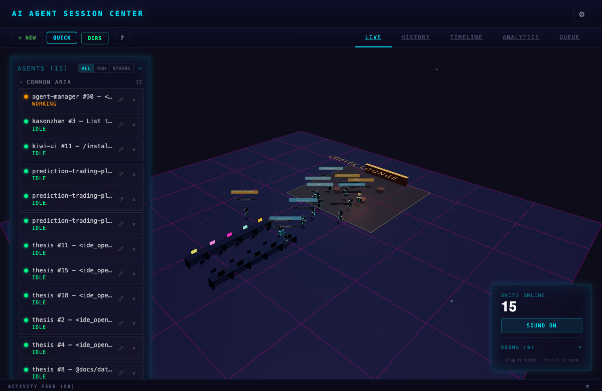

# AI Agent Session Center

Real-time 3D dashboard for monitoring and controlling Claude Code, Gemini CLI, and Codex sessions — live SSH terminals, prompt history, tool logs, and queuing. Runs on any device.

Every session spawns an animated robot in an interactive cyberdrome that visually reflects what the agent is doing — running when executing tools, waving when prompting, waiting when it needs your approval.

[](https://www.npmjs.com/package/ai-agent-session-center)
[](https://www.npmjs.com/package/ai-agent-session-center)
[](https://nodejs.org)
[](./LICENSE)

<p align="center">
  
</p>

<p align="center">
  
</p>

<details>
<summary>Detail panel view</summary>

<p align="center">
  
</p>

</details>

https://github.com/user-attachments/assets/004ee6f9-942c-44c2-a4c5-d971fa0e824b

## Why?

When you're running multiple AI coding agents across different terminals — Claude Code in one, Gemini in another, Codex in a third — it's impossible to keep track of what each one is doing. Which agent is stuck waiting for approval? Which one finished and needs your next prompt? Which one is burning tokens on a runaway loop? Agent Session Center gives you a single view across all your AI coding sessions so you can stay in control without constantly switching terminals.

## Features

- **One agent, one robot** — every AI coding session gets its own animated 3D character in the cyberdrome
- **Live activity tracking** — robots animate based on what the agent is actually doing (writing, reading, running commands, waiting for approval)
- **Multi-CLI support** — monitors Claude Code, Gemini CLI, and Codex simultaneously
- **SSH terminal sessions** — create and manage SSH/local terminal connections directly from the dashboard
- **Dynamic room system** — organize sessions into rooms with a full 3D office layout (rooms, coffee lounge, gym, corridor desks)
- **Prompt queue** — stage, reorder, and send prompts to agents with drag-and-drop
- **Team visualization** — sub-agent teams render as connected robots with animated laser-line beams
- **Approval alerts** — screaming yellow card, visor flash, and 3-burst alarm when tools need your approval
- **Session resume** — reconnect to disconnected Claude sessions with one click
- **9 scene themes** — Command Center, Cyberpunk, Dracula, Nord, Monokai, Solarized, Light, Warm, Blonde
- **Sound system** — 16 synthesized tones, per-CLI profiles, 6 ambient presets (rain, lo-fi, server room, deep space, coffee shop)
- **Analytics** — usage heatmaps, tool breakdowns, project rankings, and timeline visualization
- **History search** — full-text search across all prompts, responses, and tool names
- **Keyboard shortcuts** — full keyboard navigation for power users

## Requirements

- **Node.js 18+** with npm
- **jq** (recommended) for hook enrichment — hooks still work without it but with less metadata
- One or more supported AI CLIs:
  - [Claude Code](https://docs.anthropic.com/en/docs/claude-code)
  - [Gemini CLI](https://github.com/google-gemini/gemini-cli)
  - [Codex CLI](https://github.com/openai/codex)

## Getting Started

### Using npx (Recommended)

```bash
npx ai-agent-session-center
```

The dashboard starts at **http://localhost:3333** (default port, configurable during setup) and automatically configures hooks.

### Global Install (if npx is not available)

```bash
npm install -g ai-agent-session-center
ai-agent-session-center
```

### Uninstall

```bash
# Remove hooks from all CLI configs
npx ai-agent-session-center --uninstall

# If installed globally
npm uninstall -g ai-agent-session-center
```

### From Source

```bash
git clone https://github.com/coding-by-feng/ai-agent-session-center.git
cd ai-agent-session-center
npm install
npm run dev
```

### Usage

1. Start the dashboard — robots appear automatically as you use AI CLIs in any terminal
2. Click **+ New** to create SSH terminal sessions directly from the dashboard
3. Click a robot to view full session details (prompts, tools, activity, terminal, notes, queue)
4. Assign sessions to rooms to organize your workspace in the 3D scene
5. Open **Settings** to customize themes, sounds, and hook density

### CLI Options

```bash
ai-agent-session-center [options]

Options:
  --port <number>    Server port (default: 3333)
  --no-open          Don't auto-open browser
  --debug            Enable verbose logging
  --setup            Re-run the interactive setup wizard
  --uninstall        Remove all hooks from CLI configs and exit
```

## How It Works

Agent Session Center uses lightweight bash hooks that append JSON events to a file-based message queue (`/tmp/claude-session-center/queue.jsonl`). The server watches this file and broadcasts updates to connected browsers via WebSocket.

No modifications to any CLI are needed. The hooks are purely observational and add negligible overhead (~2-5ms per event). **End-to-end latency: 3-17ms** from hook fired to browser updated.

```
AI CLI (Claude / Gemini / Codex)
         |
    Hook Script (bash)                    ~2-5ms
    - Enriches with PID, TTY, terminal env
         |
  /tmp/.../queue.jsonl                    ~0.1ms
  - Atomic POSIX append
         |
  Server (Express + WebSocket)            ~0.5ms
  - Validate, process, broadcast
         |
  React Frontend
  - 3D scene + detail panels update
```

### Session Matching

When a hook event arrives, a 5-priority fallback system links it to the correct terminal session: pending resume match, terminal ID env var, working directory match, path scan, and PID parent check. If no match is found, a display-only card is created with the detected source (VS Code, iTerm, Warp, Ghostty, etc.).

### Hook Density Levels

| Level | Events | Use Case |
|-------|--------|----------|
| high | All 14 Claude events | Full monitoring, approval detection |
| medium | 12 events | Default, good balance |
| low | 5 events | Minimal overhead |

## Tech Stack

- **Backend**: Node.js 18+ (ESM), Express 5, WebSocket (ws), tsx
- **Frontend**: React 19, TypeScript, Vite
- **3D Visualization**: Three.js, React Three Fiber, drei
- **State Management**: Zustand, React Query
- **Terminal**: xterm.js, node-pty
- **Database**: SQLite (server, WAL mode) + IndexedDB via Dexie (browser)
- **Hooks**: Bash scripts (file-based MQ primary, HTTP fallback)
- **Testing**: Vitest (400+ tests) + Playwright (E2E)
- **Charts**: Recharts
- **Drag & Drop**: @dnd-kit

## Session States

| Status | What it means | Visual |
|--------|---------------|--------|
| **Idle** | No activity | Green, robot seeks coffee lounge |
| **Prompting** | You just sent a prompt | Cyan, robot walks to desk |
| **Working** | Agent is calling tools | Orange, charging effect |
| **Waiting** | Agent finished, your turn | Cyan, robot goes to gym |
| **Approval** | Tool blocked, needs yes/no | Yellow, visor flash, alarm |
| **Input** | Waiting for your answer | Purple, arm raised |
| **Ended** | Session closed | Red, offline animation |

## Keyboard Shortcuts

| Key | Action |
|-----|--------|
| `/` | Focus search |
| `Escape` | Close modal / deselect session |
| `?` | Toggle shortcuts panel |
| `S` | Toggle settings |
| `K` | Kill selected session |
| `A` | Archive selected session |
| `T` | New terminal session |
| `M` | Mute/unmute all |

## Known Limitations

- **Session matching heuristic** — linking hook events to SSH terminals uses a multi-priority fallback system. Two sessions in the same working directory may occasionally cross-link.
- **Approval detection timing** — auto-approved long-running commands (npm install, builds) will briefly show as "waiting for approval" for ~8 seconds until the post-tool event clears it.
- **macOS/Linux focused** — primary development is on macOS. Linux should work identically. Windows support via PowerShell hook variant is less tested.
- **3D scene performance** — with many concurrent sessions (20+), the Three.js scene may impact performance on lower-end hardware.

## Roadmap

Contributions and ideas are welcome in these areas:

- **More CLI integrations** — support for OpenCode, Cursor, Windsurf, or any agentic framework
- **Remote monitoring** — dashboard accessible from other machines on the network
- **Agent creation templates** — define agents with custom system prompts, tools, and configurations before launching
- **Collaboration** — multi-user dashboards where teams can see each other's agent sessions
- **Mobile companion** — responsive PWA for monitoring on the go
- **Plugin system** — extensible hooks for custom visualizations and integrations
- **Community themes** — user-contributed 3D scene themes and robot models

If any of these interest you, feel free to open an issue or submit a PR.

## Commands

```bash
npm run dev              # Development (Vite HMR + backend)
npm run build            # Build frontend for production
npm start                # Start production server
npm run setup            # Interactive setup wizard
npm run install-hooks    # Install hooks into CLI configs
npm run uninstall-hooks  # Remove all dashboard hooks
npm run reset            # Reset everything (hooks, config, backup)
npm test                 # Run tests (400+ Vitest tests)
npm run test:watch       # Watch mode
npm run test:e2e         # E2E tests (Playwright)
npm run debug            # Start with verbose logging
```

## Troubleshooting

### Hooks Not Firing

```bash
# Verify hooks are registered
cat ~/.claude/settings.json | grep dashboard-hook

# Test manually
echo '{"session_id":"test","hook_event_name":"SessionStart"}' | ~/.claude/hooks/dashboard-hook.sh

# Re-install
npm run install-hooks
```

### Port 3333 in Use

The server auto-resolves port conflicts. To use a different port:

```bash
npx ai-agent-session-center --port 4444
PORT=4444 npm start
```

### jq Not Installed

```bash
# macOS
brew install jq

# Ubuntu/Debian
sudo apt-get install jq
```

## Contributing

Contributions are welcome! See [CONTRIBUTING.md](CONTRIBUTING.md) for guidelines on how to get started.

## Changelog

See [CHANGELOG.md](CHANGELOG.md) for a detailed list of changes in each release.

## License

This project is licensed under the [MIT License](LICENSE).
