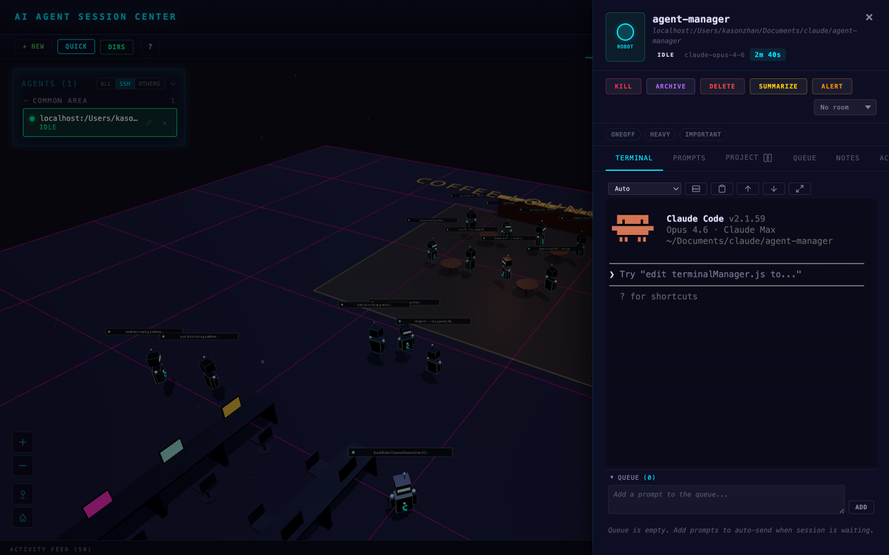
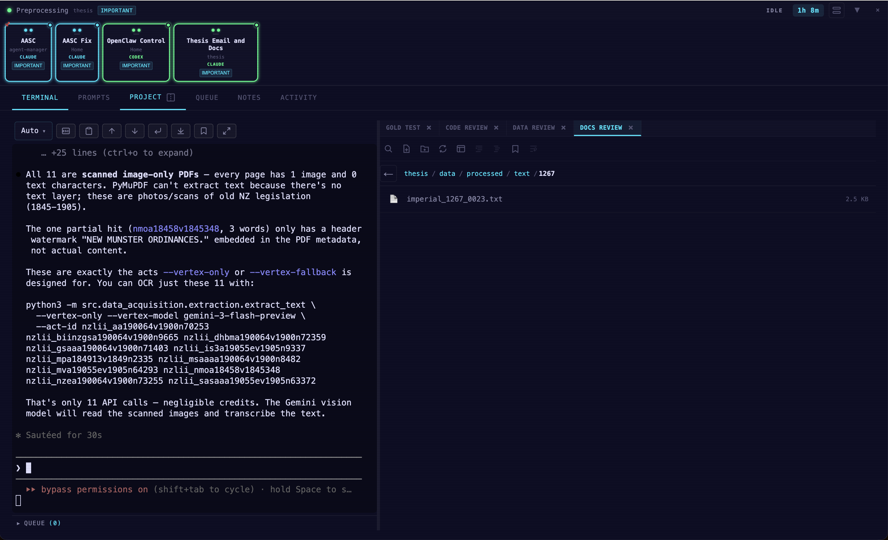
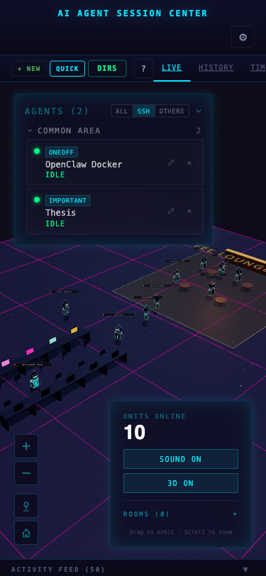
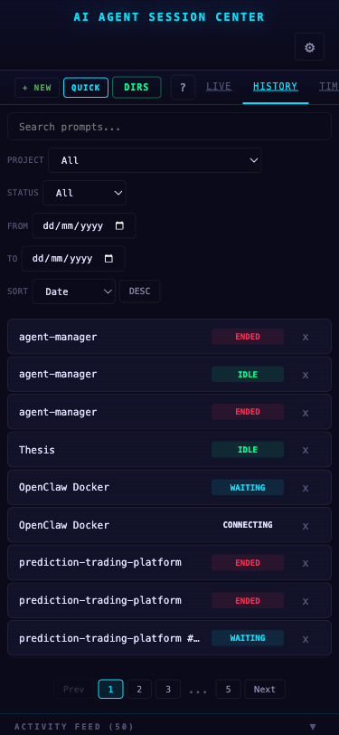

# AI Agent Session Center

A lightweight, real-time dashboard that replaces heavy IDEs like VS Code and JetBrains for AI agent workflows. Monitor and control all your Claude Code, Gemini CLI, and Codex sessions from one place — with live SSH terminals, prompt history, tool logs, and queuing. Every session spawns an animated 3D robot in an interactive cyberdrome that visually reflects what the agent is doing. Runs on any device, anywhere.

[](https://www.npmjs.com/package/ai-agent-session-center)
[](https://www.npmjs.com/package/ai-agent-session-center)
[](https://nodejs.org)
[](./LICENSE)

## Demo

**[Live demo → aasc.work/demo](https://aasc.work/demo)**

### Desktop

<table>
  <tr>
    <td></td>
    <td></td>
  </tr>
  <tr>
    <td></td>
    <td></td>
  </tr>
</table>

### Mobile

<table>
  <tr>
    <td></td>
    <td></td>
    <td></td>
    <td></td>
  </tr>
</table>

### Video

https://github.com/user-attachments/assets/004ee6f9-942c-44c2-a4c5-d971fa0e824b

## Why?

When you're running multiple AI coding agents across different terminals — Claude Code in one, Gemini in another, Codex in a third — it's impossible to keep track of what each one is doing. Which agent is stuck waiting for approval? Which one finished and needs your next prompt? Which one is burning tokens on a runaway loop? Agent Session Center gives you a single view across all your AI coding sessions so you can stay in control without constantly switching terminals.

## Features

### 3D Cyberdrome Scene

- **One agent, one robot** — every AI coding session gets its own animated 3D character in an interactive cyberdrome
- **8 animation states** — robots idle, walk, run, wait, dance, wave, or go offline based on real-time session status
- **6 procedural robot models** — robot, mech, drone, spider, orb, and tank variants with auto-assigned neon colors
- **Dynamic room system** — four-quadrant office layout with desks, coffee lounge, gym, corridor rooms, and spatial navigation AI
- **Subagent connections** — parent-child agent teams render as connected robots with animated laser-line beams
- **Speech bubbles & particles** — floating dialogue shows current tool/prompt, burst particles on state transitions
- **Camera fly-to** — smooth animated camera focuses on the selected robot; OrbitControls for manual pan/zoom/rotate
- **Flat list fallback** — 2D sidebar list auto-activates if 3D crashes or for low-resource environments

### Session Detail Panel

- **Resizable detail panel** — slides in from the right (320px–95vw) with 7 tabs: Terminal, Prompts, Project, Queue, Notes, Activity, Summary
- **Session switcher** — horizontal tab strip shows all active sessions with sequence numbers, pin/unpin, compact/detailed display modes
- **Editable metadata** — inline-edit title, label, accent color (customizes robot glow), and pin state; all persisted to SQLite + IndexedDB
- **Session controls** — Resume, Kill, Archive, Delete, Summarize, Alert, room assignment, and label chips (ONEOFF, HEAVY, IMPORTANT)
- **Split view** — Terminal and Project side-by-side with a draggable divider (ratio persisted per session)
- **Approval alerts** — yellow card, visor flash, and 3-burst alarm when tools need user approval

### Terminal & SSH

- **Full terminal emulation** — xterm.js 5 with 256 colors, Unicode 11, WebLinks, and FitAddon
- **Local & SSH sessions** — create terminals with working directory, command, SSH host/key/password, tmux wrap/attach
- **Session resume** — reconnect to disconnected Claude sessions via `claude --resume` with one click
- **Terminal bookmarks** — save scroll positions with notes, jump back to any bookmarked line
- **Terminal toolbar** — fullscreen, clear, copy, paste, theme selector (auto, light, dark, Solarized, Dracula, custom)
- **Bidirectional WebSocket relay** — real-time I/O, 50ms debounced resize, Escape forwards `\x1b` to SSH

### Project File Browser

- **Browse & search** — navigate project directories, full-text file search with cached results
- **Syntax highlighting** — code viewer with line numbers, word wrap toggle, and markdown outline panel
- **Sub-tab system** — open multiple directories/files in tabs within the Project panel
- **File bookmarks** — save line references with notes; bookmarked lines highlighted in the code viewer; cross-file navigation
- **Sort & filter** — sort by name or date, toggle date/time display, file size shown per entry
- **File editing** — inline editor with save support for quick edits

### Multi-CLI Monitoring

- **Three AI CLIs** — Claude Code (up to 14 events), Gemini CLI (4 events), and Codex (1 event)
- **3 hook density levels** — High (full monitoring), Medium (default, 12 events), Low (5 events, minimal overhead)
- **File-based message queue** — hooks append to JSONL queue file via atomic POSIX append (~0.1ms); HTTP POST fallback
- **3–17ms end-to-end latency** — from hook fired to browser updated
- **5-priority session matching** — pending resume, terminal ID, working directory, path scan, PID parent check
- **Approval detection** — tool-category timeouts with child-process check; `PermissionRequest` event for reliable signal
- **CLI badge detection** — auto-detects CLAUDE, GEMINI, CODEX, or AIDER from launch command

### Prompt Queue

- **Global queue view** — see all pending prompts across every session in one place
- **Per-session queue** — compose, reorder (drag-and-drop), send, and move prompts between sessions
- **Auto-send mode** — queued prompts auto-dispatch when the target session becomes idle

### Analytics & History

- **History search** — full-text search across titles, projects, and labels with date range, status, and sort filters
- **Analytics dashboard** — summary cards, 7-day activity heatmap, tool usage breakdown, active projects ranking
- **Timeline view** — time-series visualization (hourly, daily, weekly) of sessions, prompts, and tool calls

### Theming & Sound

- **9 scene themes** — Command Center, Cyberpunk, Dracula, Nord, Monokai, Solarized, Light, Warm, Blonde
- **16 synthesized sounds** — per-CLI profiles with per-event sound mapping (chime, ping, alarm, fanfare, etc.)
- **6 ambient presets** — rain, lo-fi, server room, deep space, coffee shop, or off
- **Visual effects** — glowing card borders, pulsing animations, scanline CRT overlay, status particles, fog depth by theme

### Notes & Summaries

- **Session notes** — plain-text notes with full CRUD, stored in both SQLite and IndexedDB
- **AI-powered summaries** — generate session summaries via configured LLM API with customizable prompt templates

### Authentication & Security

- **Password protection** — optional login with HttpOnly cookie (1-hour TTL), rate-limited (5 attempts/15min)
- **Security headers** — X-Frame-Options, CSP, CORS, localhost-only hook endpoint, shell metacharacter injection prevention
- **Directory traversal protection** — `resolveProjectPath()` validates all file browser paths

### Keyboard Shortcuts

- **Full keyboard navigation** — `/` search, `T` new terminal, `K` kill, `A` archive, `M` mute, `S` settings, `?` shortcuts panel
- **Rebindable shortcuts** — customize every shortcut from Settings with conflict detection
- **Session switching** — `Alt+Cmd+1`–`9` to select Nth session by status priority

### Data Persistence

- **Dual storage** — SQLite on server (sessions, prompts, tools, events, notes) + IndexedDB via Dexie in browser (12 tables)
- **Auto-snapshots** — server saves full state every 10 seconds; SSH terminals auto-respawn on restart
- **Session ID migration** — seamless re-keying when sessions resume with new IDs

> See [docs/feature/README.md](docs/feature/README.md) for the complete features reference with architecture details and API documentation.

## Requirements

- **Node.js 18+** with npm
- **jq** (recommended) for hook enrichment — hooks still work without it but with less metadata
- One or more supported AI CLIs:
  - [Claude Code](https://docs.anthropic.com/en/docs/claude-code)
  - [Gemini CLI](https://github.com/google-gemini/gemini-cli)
  - [Codex CLI](https://github.com/openai/codex)

## Getting Started

### Using npx (Recommended)

```bash
npx ai-agent-session-center
```

The dashboard starts at **http://localhost:3333** (default port, configurable during setup) and automatically configures hooks.

### Global Install (if npx is not available)

```bash
npm install -g ai-agent-session-center
ai-agent-session-center
```

### Uninstall

```bash
# Remove hooks from all CLI configs
npx ai-agent-session-center --uninstall

# If installed globally
npm uninstall -g ai-agent-session-center
```

### From Source

```bash
git clone https://github.com/coding-by-feng/ai-agent-session-center.git
cd ai-agent-session-center
npm install
npm run dev
```

### Usage

1. Start the dashboard — robots appear automatically as you use AI CLIs in any terminal
2. Click **+ New** to create SSH terminal sessions directly from the dashboard
3. Click a robot to view full session details (prompts, tools, activity, terminal, notes, queue)
4. Assign sessions to rooms to organize your workspace in the 3D scene
5. Open **Settings** to customize themes, sounds, and hook density

### CLI Options

```bash
ai-agent-session-center [options]

Options:
  --port <number>    Server port (default: 3333)
  --no-open          Don't auto-open browser
  --debug            Enable verbose logging
  --setup            Re-run the interactive setup wizard
  --uninstall        Remove all hooks from CLI configs and exit
```

## How It Works

Agent Session Center uses lightweight bash hooks that append JSON events to a file-based message queue (`/tmp/claude-session-center/queue.jsonl`). The server watches this file and broadcasts updates to connected browsers via WebSocket.

No modifications to any CLI are needed. The hooks are purely observational and add negligible overhead (~2-5ms per event). **End-to-end latency: 3-17ms** from hook fired to browser updated.

```
AI CLI (Claude / Gemini / Codex)
         |
    Hook Script (bash)                    ~2-5ms
    - Enriches with PID, TTY, terminal env
         |
  /tmp/.../queue.jsonl                    ~0.1ms
  - Atomic POSIX append
         |
  Server (Express + WebSocket)            ~0.5ms
  - Validate, process, broadcast
         |
  React Frontend
  - 3D scene + detail panels update
```

### Session Matching

When a hook event arrives, a 5-priority fallback system links it to the correct terminal session: pending resume match, terminal ID env var, working directory match, path scan, and PID parent check. If no match is found, a display-only card is created with the detected source (VS Code, iTerm, Warp, Ghostty, etc.).

### Hook Density Levels

| Level | Events | Use Case |
|-------|--------|----------|
| high | All 14 Claude events | Full monitoring, approval detection |
| medium | 12 events | Default, good balance |
| low | 5 events | Minimal overhead |

## Tech Stack

- **Backend**: Node.js 18+ (ESM), Express 5, WebSocket (ws), tsx
- **Frontend**: React 19, TypeScript, Vite
- **3D Visualization**: Three.js, React Three Fiber, drei
- **State Management**: Zustand, React Query
- **Terminal**: xterm.js, node-pty
- **Database**: SQLite (server, WAL mode) + IndexedDB via Dexie (browser)
- **Hooks**: Bash scripts (file-based MQ primary, HTTP fallback)
- **Testing**: Vitest (400+ tests) + Playwright (E2E)
- **Charts**: Recharts
- **Drag & Drop**: @dnd-kit

## Session States

| Status | What it means | Visual |
|--------|---------------|--------|
| **Idle** | No activity | Green, robot seeks coffee lounge |
| **Prompting** | You just sent a prompt | Cyan, robot walks to desk |
| **Working** | Agent is calling tools | Orange, charging effect |
| **Waiting** | Agent finished, your turn | Cyan, robot goes to gym |
| **Approval** | Tool blocked, needs yes/no | Yellow, visor flash, alarm |
| **Input** | Waiting for your answer | Purple, arm raised |
| **Ended** | Session closed | Red, offline animation |

## Keyboard Shortcuts

| Key | Action |
|-----|--------|
| `/` | Focus search |
| `Escape` | Close modal / deselect session |
| `?` | Toggle shortcuts panel |
| `S` | Toggle settings |
| `K` | Kill selected session |
| `A` | Archive selected session |
| `T` | New terminal session |
| `M` | Mute/unmute all |

## Known Limitations

- **Session matching heuristic** — linking hook events to SSH terminals uses a multi-priority fallback system. Two sessions in the same working directory may occasionally cross-link.
- **Approval detection timing** — auto-approved long-running commands (npm install, builds) will briefly show as "waiting for approval" for ~8 seconds until the post-tool event clears it.
- **macOS/Linux focused** — primary development is on macOS. Linux should work identically. Windows support via PowerShell hook variant is less tested.
- **3D scene performance** — with many concurrent sessions (20+), the Three.js scene may impact performance on lower-end hardware.

## Roadmap

Contributions and ideas are welcome in these areas:

- **More CLI integrations** — support for OpenCode, Cursor, Windsurf, or any agentic framework
- **Remote monitoring** — dashboard accessible from other machines on the network
- **Agent creation templates** — define agents with custom system prompts, tools, and configurations before launching
- **Collaboration** — multi-user dashboards where teams can see each other's agent sessions
- **Mobile companion** — responsive PWA for monitoring on the go
- **Plugin system** — extensible hooks for custom visualizations and integrations
- **Community themes** — user-contributed 3D scene themes and robot models

If any of these interest you, feel free to open an issue or submit a PR.

## Commands

```bash
npm run dev              # Development (Vite HMR + backend)
npm run build            # Build frontend for production
npm start                # Start production server
npm run setup            # Interactive setup wizard
npm run install-hooks    # Install hooks into CLI configs
npm run uninstall-hooks  # Remove all dashboard hooks
npm run reset            # Reset everything (hooks, config, backup)
npm test                 # Run tests (400+ Vitest tests)
npm run test:watch       # Watch mode
npm run test:e2e         # E2E tests (Playwright)
npm run debug            # Start with verbose logging
```

## Troubleshooting

### Hooks Not Firing

```bash
# Verify hooks are registered
cat ~/.claude/settings.json | grep dashboard-hook

# Test manually
echo '{"session_id":"test","hook_event_name":"SessionStart"}' | ~/.claude/hooks/dashboard-hook.sh

# Re-install
npm run install-hooks
```

### Port 3333 in Use

The server auto-resolves port conflicts. To use a different port:

```bash
npx ai-agent-session-center --port 4444
PORT=4444 npm start
```

### jq Not Installed

```bash
# macOS
brew install jq

# Ubuntu/Debian
sudo apt-get install jq
```

## Contributing

Contributions are welcome! See [CONTRIBUTING.md](CONTRIBUTING.md) for guidelines on how to get started.

## Changelog

See [CHANGELOG.md](CHANGELOG.md) for a detailed list of changes in each release.

## License

This project is licensed under the [MIT License](LICENSE).
