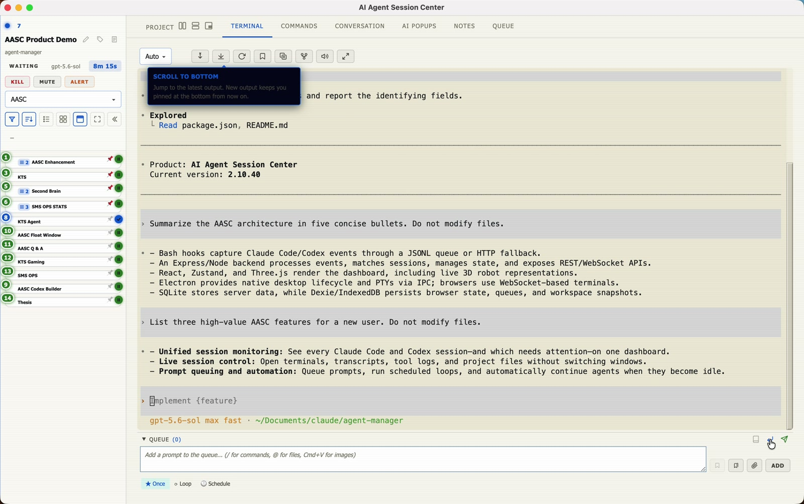
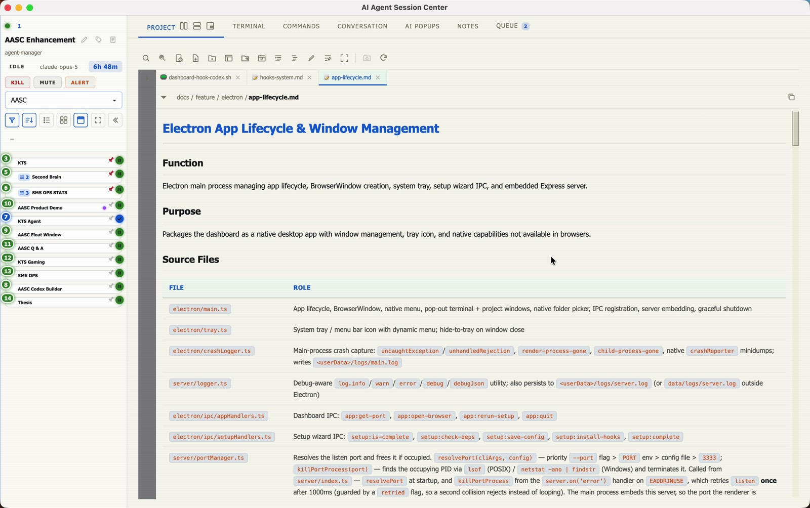
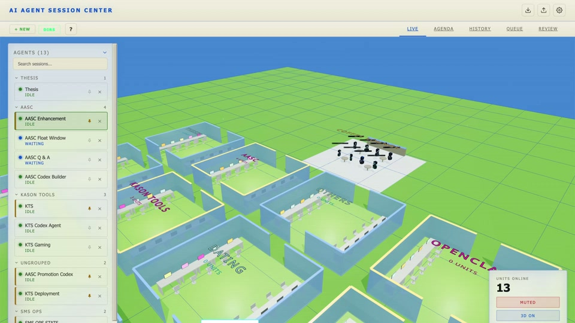
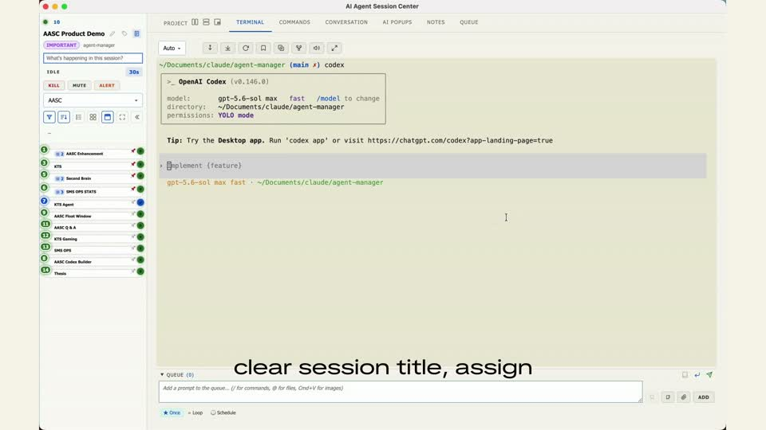

# AI Agent Session Center

**One dashboard for all your Claude Code and Codex sessions — see which agent needs you, work in live terminals, queue the next prompt, and pick your whole workspace back up after a restart.**

A desktop app (macOS) and a browser UI over the same local server, with an optional 3D "cyberdrome" view. No telemetry — the [FAQ](#faq) lists the few things that call out.

[](https://github.com/coding-by-feng/ai-agent-session-center/releases)
[](https://nodejs.org)
[](./LICENSE)

### **[▶ Try the interactive demo — runs in your browser with mock sessions, no install → aasc.work/demo](https://aasc.work/demo)**


<sub>The LIVE view with the optional 3D scene turned on. The session list on the left shows the same sessions without it, and is what you get by default.</sub>

**Jump to:** [Get started](#get-started) · [What you can do](#what-you-can-do) · [How it works](#how-it-works) · [What it changes on your machine](#what-it-changes-on-your-machine) · [Phone and LAN access](#phone-and-lan-access) · [Commands](#commands) · [Troubleshooting](#troubleshooting) · [FAQ](#faq)

> You're running Claude Code in one terminal and Codex in another. Which one is **waiting for your approval**? Which one **finished** and needs your next prompt? Which one **died on an API error** and is just sitting there? Agent Session Center watches all of them at once and tells you which one needs you — so you stop tab-juggling and step in only when it matters.

---

## Get started

### Desktop app — macOS (Apple Silicon)

1. Download `AI.Agent.Session.Center-<version>-arm64.dmg` from the [latest release](https://github.com/coding-by-feng/ai-agent-session-center/releases/latest) and drag the app into Applications.
2. The app is **not notarized by Apple**, so macOS may say it is "damaged and can't be opened". Open **Open App (Start Here).command** in the DMG window instead: it walks you through clearing the quarantine flag and launching the app.
3. Follow the setup wizard. It requires a password — that password is what keeps other devices on your network out (see [Phone and LAN access](#phone-and-lan-access)).

Releases ship macOS Apple Silicon builds. A Windows installer was attached to v2.10.40 but not to the releases after it; on Windows, run from source (below).

### Run from source — any OS with Node.js

```bash
git clone https://github.com/coding-by-feng/ai-agent-session-center.git
cd ai-agent-session-center
npm install
npm rebuild better-sqlite3 node-pty   # npm install builds these for Electron; this rebuilds them for your Node
npm run build
npm start                             # opens http://localhost:3333
```

For development, `npm run dev` starts Vite with hot reload on http://localhost:3332 and the backend on 3333.

### Requirements

- **Node.js 22.12+** (to run from source) with npm
- **jq** — strongly recommended. The hook uses it to add the process and terminal details that link each event to the right terminal; without it, sessions may not be matched to their terminals.
- One or more of the supported CLIs: [Claude Code](https://code.claude.com/docs) or [Codex CLI](https://github.com/openai/codex). Codex hooks are opt-in (choose Codex in the setup wizard) and need Codex CLI 0.130 or newer.

### First run

1. Start the dashboard. It registers its hooks for the CLIs you enabled (Claude Code by default).
2. Run `claude` (or `codex`, if you enabled Codex) in any terminal — the session appears on **LIVE** within a moment. Or press **+ NEW** to start a local session from the dashboard.
3. Click a session to open its panel: **PROJECT · TERMINAL · COMMANDS · CONVERSATION · AI POPUPS · NOTES · QUEUE**.
4. The 3D scene is off by default; the **3D** button on LIVE turns it on.

<details>
<summary><b>Server options (from source)</b></summary>

```bash
npm start -- --port 4444    # or: PORT=4444 npm start   (--port > PORT > saved setting > 3333)
npm start -- --no-open      # don't open a browser (also: npm run start:no-open)
npm run debug               # verbose logging
npm run setup               # interactive setup: port, which CLIs to hook, hook density, password
npm run uninstall-hooks     # remove the hooks from the CLI configs
```

</details>

---

## What you can do

**Know which agent needs you.** Every session shows where it is — working, waiting for you, needing approval, needing an answer, idle, ended — with sound alerts you can tune per CLI, so the blocked one stands out. Organise sessions into rooms, pin the ones you care about, label and annotate them.

**Work in live terminals.** Real xterm.js terminals owned by the server and streamed over WebSocket, so a browser tab, the desktop app and a phone can all attach to the same one. Resume (`claude --resume`), fork and clone sessions, and — in the desktop app — pop terminals, projects and whole sessions out into their own windows on another display.

**Queue the next prompt.** Per-session queues with once, loop and schedule items, before/after chains, quiet hours and drag-to-reorder. A queued prompt is sent when the session goes idle; the queue holds after you press Esc and while subagents run. A saved-prompt library keeps the ones you reuse, and the queue is shared across your devices. Loops and schedules fire only while a dashboard window is open.

**Recover from API errors.** When a turn dies on an overload, 5xx, rate-limit or network error, the session is flagged and — unless you switch **🩺 Auto-resume** off in its queue panel — the dashboard sends a "continue" prompt for you: up to 3 attempts per 30 minutes, backing off 30 s, 2 min, then 8 min.

**Pick the workspace back up.** Save and restore your layout, rooms and sessions; the server also snapshots itself every 10 seconds. After a restart, a restore picker rebuilds the workspace and resumes your sessions.

**Read and navigate the work.** A project browser (file tree, fuzzy find, syntax highlighting, Markdown, TeX, image and spreadsheet viewers, inline editing), the full conversation transcript with search, per-session notes in Markdown with images and video, and global **HISTORY** and **PROMPTS** views that search the prompt text you have sent.

**Ask about anything you select.** Highlight text in a terminal or a file and fork a floating AI session that explains, translates or defines it; **REVIEW** keeps the answers you starred. **Summarize** condenses a session through your own `claude` CLI.

**See your agent resources.** A read-only **RESOURCES** tab catalogues the skills, commands, rules, agents, hooks, MCP servers, plugins, memory and instruction files in `~/.claude`, `~/.codex`, `~/.agents` and your projects, with secrets masked. It is available on the host machine only.

**Make it yours.** Ten themes (the default is a light Windows XP look), 15 synthesized event sounds with per-CLI profiles, ambient presets, rebindable keyboard shortcuts — and an optional 3D cyberdrome with procedural robots, project rooms and a coffee lounge.

<table>
  <tr>
    <td width="50%"><br><sub>A session's terminal with its prompt queue underneath.</sub></td>
    <td width="50%"><br><sub>The PROJECT tab: file browser and Markdown viewer.</sub></td>
  </tr>
</table>

### Product videos

<table>
  <tr>
    <td width="50%" valign="top">
      <a href="https://github.com/coding-by-feng/ai-agent-session-center/releases/download/v2.10.40/aasc-product-introduction.mp4"></a>
      <br><strong>58-second product introduction</strong>
      <br>The core monitoring, terminal, project, notes, queue and contextual AI workflows, with US English narration.
      <br><a href="https://github.com/coding-by-feng/ai-agent-session-center/releases/download/v2.10.40/aasc-product-introduction.mp4">Watch the short introduction</a>
    </td>
    <td width="50%" valign="top">
      <a href="https://github.com/coding-by-feng/ai-agent-session-center/releases/download/v2.10.40/aasc-full-product-walkthrough.mp4"></a>
      <br><strong>12-minute full product walkthrough</strong>
      <br>Session organization, terminals, projects, queues, notes, conversation review and AI popups, start to finish.
      <br><a href="https://github.com/coding-by-feng/ai-agent-session-center/releases/download/v2.10.40/aasc-full-product-walkthrough.mp4">Watch the full walkthrough</a>
    </td>
  </tr>
</table>

<sub>Recorded on v2.10.40; some details have changed since.</sub>

---

## How it works

Small hook scripts run inside each CLI, in the background so they never slow it down, and append one JSON line per event to a message queue file (`/tmp/claude-session-center/queue.jsonl`). The server watches that file, works out which terminal and session each event belongs to, and pushes updates to every connected browser over WebSocket.

```
Claude Code / Codex
        │  hook script (bash; PowerShell on Windows) — adds PID, TTY and terminal details
        ▼
/tmp/claude-session-center/queue.jsonl     (atomic append)
        │
        ▼
Server — Express + WebSocket               (validate → match to a session → state machine → broadcast)
        │
        ▼
Browser / desktop app — React              (session list, terminals, queue, optional 3D scene)
```

**Matching.** Each event is linked to the right session by a priority cascade — pending resume, terminal ID, working directory, process tree, and more. A session started somewhere the dashboard doesn't own (another terminal, an editor) still shows up: a hook event with a controlling terminal creates an "external" card, and a periodic process scan finds Claude CLIs that fire no hooks at all (not on Windows). Matching is heuristic; two sessions in one working directory can occasionally cross-link.

**Session states.**

| Status | Meaning |
|--------|---------|
| **Connecting** | A terminal was opened and its CLI hasn't reported yet |
| **Idle** | Nothing happening (a waiting session goes idle after 5 minutes) |
| **Prompting** | You just sent a prompt |
| **Working** | The agent is calling tools |
| **Waiting** | The agent finished — your turn |
| **Approval** | A tool is blocked and needs a yes/no |
| **Input** | The agent is waiting for your answer |
| **Ended** | The session closed |

**Hook density** sets how much each CLI reports: `high` (all Claude hook events — fullest monitoring and approval detection), `medium` (the default), or `low` (minimal, but no tool or subagent events, which weakens approval detection and the queue's idle check).

**Built with** Node.js, Express 5, ws and tsx on the server; React 19, TypeScript, Vite 7, Zustand 5 and Dexie on the client; xterm.js with node-pty for terminals; Three.js with React Three Fiber for the 3D scene; Electron 34 for the desktop app; SQLite (better-sqlite3) for history. Tests run on Vitest and Playwright.

---

## What it changes on your machine

| What | Where | Notes |
|------|-------|-------|
| Hook entries | `~/.claude/settings.json` (and `~/.codex/config.toml` if Codex is enabled) | Written when the server starts, for every enabled CLI — so removing them is undone by the next start while the dashboard is in use. Claude's file is written atomically. |
| Hook scripts | `~/.claude/hooks/` (and `~/.codex/hooks/`) | Copied on start. |
| Message queue | `/tmp/claude-session-center/` (`%TEMP%` on Windows) | Truncated at 1 MB. |
| Terminal title and session id | The tab title; `<project>/.claude/last-session-id` | The hook retitles the terminal tab and records the id on every session start. |
| Launch flags | Sessions started from the dashboard | `claude` gets a session name (`-n`) and, when you pick them, `--model` / `--effort` (Codex: `--model`). |
| Your data | From source: `<repo>/data/` · Desktop app: `~/Library/Application Support/ai-agent-session-center/` | SQLite history, settings, the password hash and workspace snapshots. |

The hooks only report what the CLI is doing; they never change what it does. To remove them, stop the dashboard and run `npm run uninstall-hooks` — this removes the settings entries but leaves the scripts in place. `npm run reset` goes further, and also **deletes the history database and saved settings** (backing them up to `data/backups` first).

---

## Phone and LAN access

The server listens on **all network interfaces**, so another device on your network can open `http://<your-computer's-address>:3333` — the address is shown in the startup log and in the dashboard's device chip.

- **A password is mandatory for anyone not on this machine.** Without one, every request and WebSocket from another device is refused. Set it in the setup wizard, or with `npm run set-password` from a source checkout. Logins are rate-limited (5 tries per 15 minutes) and last an hour.
- **Sessions are private until you share them.** Each session has a **SHARED / HOST ONLY** toggle (the default is host-only; a host-only session returns 404 to other devices). History, Prompts and Resources are never available remotely.
- **One device drives a session at a time** (a control baton, taken over after 60 seconds idle). A phone can read live terminals and type when it holds the baton, but it never resizes the terminal.
- **It is plain HTTP.** Use it on a network you trust, or behind a VPN. Anyone who has the password can create terminals and write files under your project folders on this machine, so treat it like SSH access.

---

## Commands

```bash
npm run dev              # Vite hot reload (:3332) + backend (:3333)
npm run build            # build the web UI
npm start                # start the server — run `npm run build` first
npm run setup            # interactive setup wizard, then starts the server
npm run set-password     # set the dashboard password
npm run install-hooks    # install hooks into the CLI configs
npm run uninstall-hooks  # remove the hooks (scripts are left in place)
npm run reset            # remove hooks AND delete history and settings (backed up first)
npm test                 # unit and integration tests (Vitest)
npm run test:e2e         # end-to-end tests (Playwright; run `npx playwright install` once)
npm run typecheck:all    # type-check the client and the server
npm run lint             # ESLint
npm run electron:dev     # build and launch the desktop app
npm run electron:build   # build an installer for the OS you are on (DMG on macOS, NSIS on Windows)
```

---

## Troubleshooting

### Hooks not firing

```bash
# Are the hooks registered?
grep dashboard-hook ~/.claude/settings.json

# Send a test event (this adds a "test" session to the dashboard)
echo '{"session_id":"test","hook_event_name":"SessionStart"}' | ~/.claude/hooks/dashboard-hook.sh

# Re-install
npm run install-hooks
```

### "was compiled against a different Node.js version" (better-sqlite3)

`npm install` builds the native modules for Electron. Rebuild them for your Node:

```bash
npm rebuild better-sqlite3 node-pty
```

(`npm run electron:rebuild` switches them back for the desktop build.)

### Port 3333 is in use

If the port is taken, the server **kills whatever is holding it** (`SIGKILL`) and retries once — including a desktop app that is already running. To run a second copy next to it, give it its own port:

```bash
npm start -- --port 4444      # or: PORT=4444 npm start
```

### jq not installed

```bash
brew install jq            # macOS
sudo apt-get install jq    # Ubuntu/Debian
```

---

## FAQ

<details>
<summary><b>Does it modify my AI CLI?</b></summary>

It never changes what the CLI does, but it does change your configuration: it registers hook entries in the CLI's settings file, copies hook scripts next to it, retitles the terminal tab, writes `.claude/last-session-id` in your project, and launches the CLIs it starts with extra flags. [What it changes on your machine](#what-it-changes-on-your-machine) lists every one.
</details>

<details>
<summary><b>Does any data leave my machine?</b></summary>

The dashboard has no telemetry and sends your sessions nowhere on its own. A few features do call out, and you control them:

- **AI popups and Summarize** run your own `claude` / `codex` CLI, so the selected text or transcript goes to your account with that provider.
- **Text-to-speech** uses Google Cloud and your own API key. It is off by default.
- **The 3D scene** loads fonts from a public CDN.
- **Phone and LAN access** serves the dashboard to other devices on your network, behind the password (see above).
</details>

<details>
<summary><b>How do I fully uninstall?</b></summary>

Stop the dashboard, run `npm run uninstall-hooks`, then delete `~/.claude/hooks/dashboard-hook.sh` (and `~/.codex/hooks/dashboard-hook.sh` if you used Codex) and the `data/` folder. `npm run reset` does the hook and data cleanup in one step, including the scripts. For the desktop app, also drag it out of Applications and delete `~/Library/Application Support/ai-agent-session-center/`.
</details>

<details>
<summary><b>Which CLIs are supported?</b></summary>

Claude Code and Codex CLI today. Codex hooks are opt-in and need Codex CLI 0.130 or newer. Other agents are on the roadmap.
</details>

<details>
<summary><b>Can I start sessions on a remote machine over SSH?</b></summary>

Not from the UI. New sessions are local terminals. Sessions on this machine that you start yourself, in any terminal, are monitored as well. To watch the dashboard from another device, see [Phone and LAN access](#phone-and-lan-access).
</details>

---

## Known limitations

- **Session matching is heuristic** — linking hook events to terminals uses a multi-priority fallback; two sessions in the same working directory may occasionally cross-link.
- **Approval detection timing** — an auto-approved long-running command (an install, a build) can briefly show as "approval" for about 8 seconds until the tool finishes. The reliable signal is Claude's `PermissionRequest` event, which needs hook density `medium` or higher.
- **Loops, schedules and the auto-resume watchdog run in the dashboard**, not on the server, and only on the device that holds the session's control baton — so they pause when no dashboard window is open.
- **Platforms** — macOS is the first-class target: the desktop app is an Apple Silicon build that is not notarized and has no auto-update. The browser dashboard runs wherever Node does; on Linux, node-pty may need a C++ toolchain to build. Windows uses a PowerShell hook variant that is less battle-tested, has no process scan, and the Codex hook is bash-only.
- **Hooks are re-registered each time the server starts**, and there is no setting to opt out.

---

## Roadmap

Contributions and ideas welcome:

- **More CLI integrations** — OpenCode, Cursor, Windsurf, or any agentic framework
- **Agent creation templates** — define system prompts, tools, and configs before launch
- **Collaboration** — multi-user dashboards where teams see each other's sessions (today it is one person on several devices)
- **Plugin system** — extensible hooks for custom visualizations
- **Community themes** — user-contributed themes and robot models

---

## Contributing

```bash
git clone https://github.com/coding-by-feng/ai-agent-session-center.git
cd ai-agent-session-center
npm install
npm rebuild better-sqlite3 node-pty   # needed to run the backend under your Node
npm run dev                           # Vite hot reload + backend
```

Run `npm test`, `npm run lint` and `npm run typecheck:all` before opening a PR (plain `npm run typecheck` covers only the client), and use conventional commit messages (`feat:`, `fix:`, `docs:`, …). Note that `npm run electron:build` rebuilds the native modules for Electron, so run the `npm rebuild` line again afterwards.

The complete reference — one doc per feature, with its architecture, APIs and change risks — lives in [`docs/feature/README.md`](docs/feature/README.md). Release notes are on the [Releases](https://github.com/coding-by-feng/ai-agent-session-center/releases) page.

## License

Released under the [MIT License](./LICENSE).
